# Fashion-AI Search Platform

**Version:** 1.0  
**Date:** January 2025  
**Project Type:** Full-Stack Web Application with AI/ML Integration

A multimodal fashion discovery platform that enables users to find fashion products using text queries or image uploads. The system integrates Instagram/Pinterest scraping, AI-powered object detection, and semantic search.

---

## Table of Contents

1. [Executive Summary](#executive-summary)
2. [System Architecture](#system-architecture)
3. [Frontend Architecture](#frontend-architecture)
4. [Backend Architecture](#backend-architecture)
5. [Data Flow Diagrams](#data-flow-diagrams)
6. [API Documentation](#api-documentation)
7. [Database Schema](#database-schema)
8. [AI/ML Integration](#aiml-integration)
9. [Features & Functionality](#features--functionality)
10. [Technology Stack](#technology-stack)
11. [Deployment](#deployment)

---

## Executive Summary

Fashion-AI Search is a multimodal fashion discovery platform that enables users to find fashion products using text queries or image uploads. The system integrates Instagram/Pinterest scraping, AI-powered object detection, and semantic search to provide an intelligent product discovery experience.

### Key Capabilities
- **Social Media Scraping**: Extract posts from Instagram and Pinterest
- **Visual Search**: Upload images to find similar fashion products
- **Text Search**: Search products using natural language queries
- **AI Detection**: Automatically detect fashion items (clothing, accessories, shoes, bags)
- **Product Catalog**: Browse and filter products by category, brand, color, price, and style
- **Shopping Cart**: Add products to cart for future purchase

---

## System Architecture

### High-Level Architecture
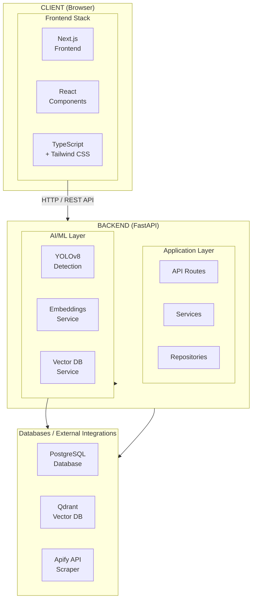

### Component Overview

**Frontend:**
- Next.js 14 with App Router
- React 18 with TypeScript
- Tailwind CSS for styling
- Client-side state management
- Responsive design

**Backend:**
- FastAPI (Python)
- SQLAlchemy for database ORM
- Async/await for concurrent operations
- RESTful API design

**AI/ML:**
- YOLOv8 for object detection
- CLIP embeddings for similarity search
- Qdrant vector database
- Semantic text search

**External Services:**
- Apify for social media scraping
- Image proxy for CORS handling

---

## Frontend Architecture

### Component Structure

```
frontend/
├── app/
│   ├── layout.tsx              # Root layout with navigation
│   ├── page.tsx                # Explore feed (homepage)
│   ├── search/
│   │   └── page.tsx            # Search interface
│   ├── scrape/
│   │   └── page.tsx            # Scraping interface
│   ├── posts/
│   │   └── page.tsx            # Posts management
│   └── product/[id]/
│       └── page.tsx            # Product details
├── components/
│   ├── navigation.tsx          # Top navigation bar
│   ├── explore-feed.tsx        # Product browsing
│   ├── search-interface.tsx    # Search UI
│   ├── instagram-scraper.tsx   # Scraping UI
│   ├── product-card.tsx        # Product display
│   ├── product-filters.tsx     # Filter sidebar
│   └── theme-provider.tsx     # Dark/light theme
├── lib/
│   └── api.ts                 # API client functions
├── types/
│   └── product.ts             # TypeScript types
└── contexts/
    └── cart-context.tsx       # Shopping cart state
```

### Frontend Flow Diagram

#### 1. User Navigation Flow

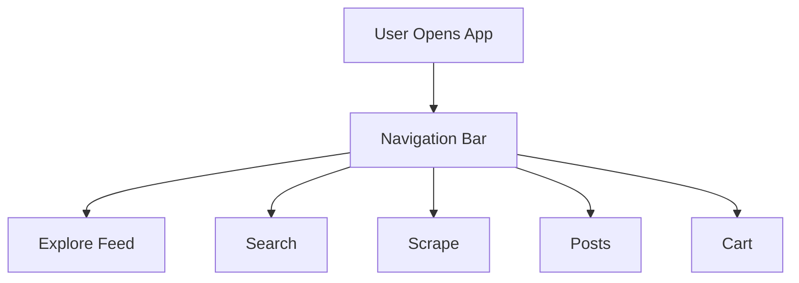

#### 2. Explore Feed Flow

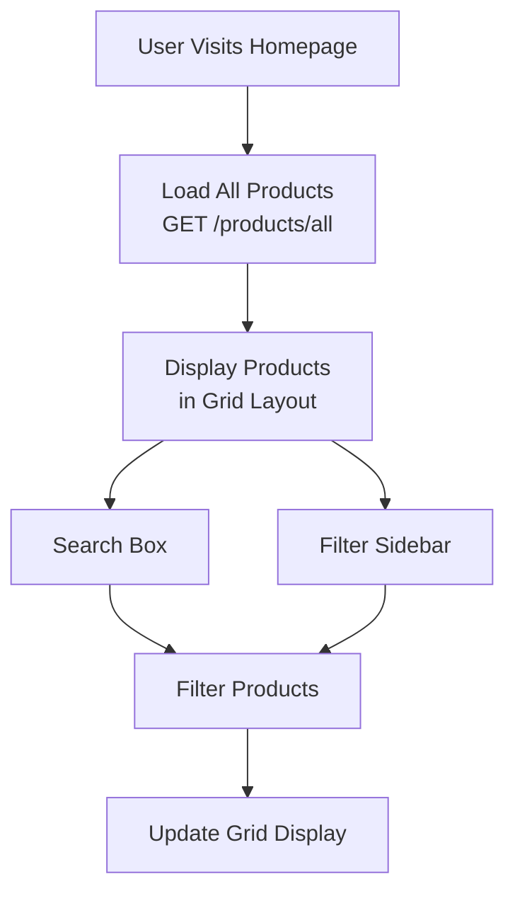

#### 3. Search Flow (Image Upload)

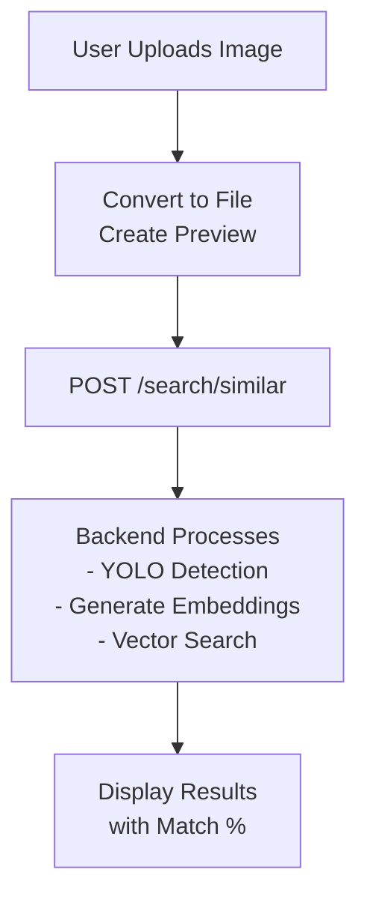

#### 4. Search Flow (Text Query)

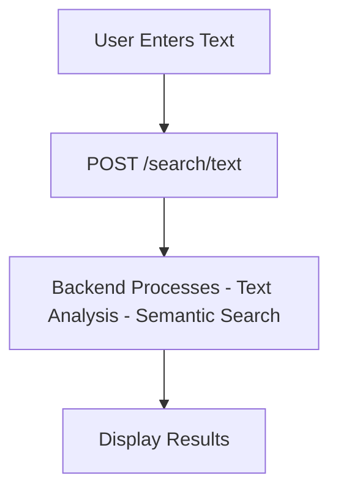

#### 5. Scraping Flow

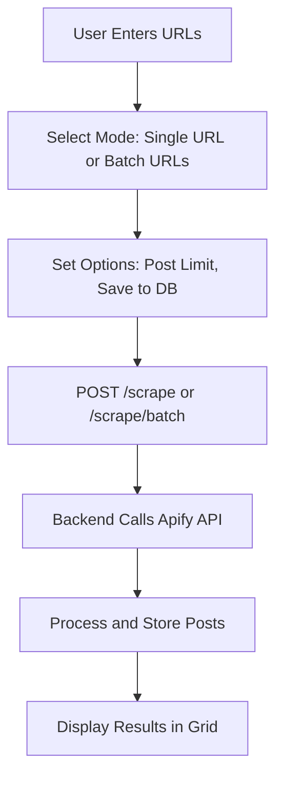

#### 6. Posts Management Flow

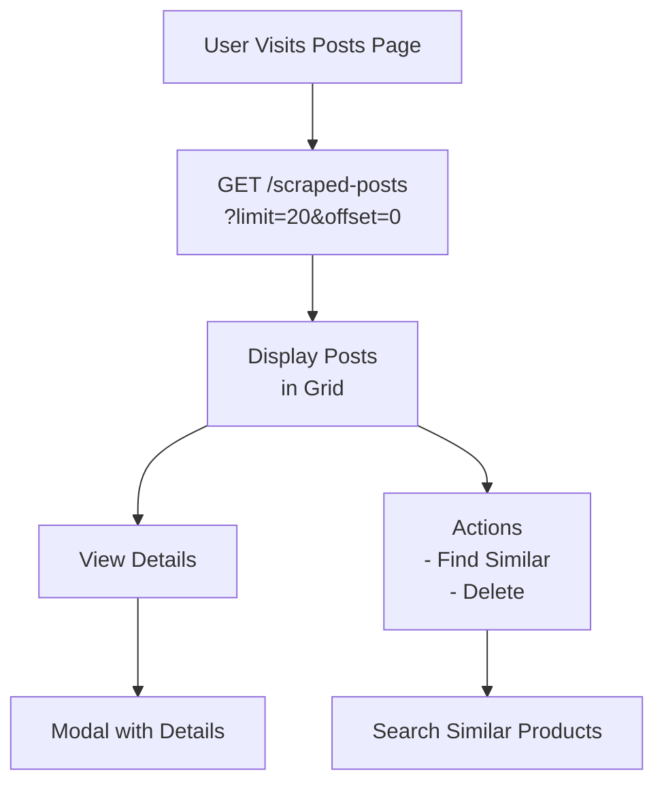

### State Management

**Client-Side State:**
- React `useState` for component state
- React Context for cart state
- Session storage for temporary data (image search)
- URL parameters for pagination

**Data Fetching:**
- Fetch API for HTTP requests
- Async/await pattern
- Error handling with try/catch
- Loading states for UX

---

## Backend Architecture

### Service Layer Structure

```
backend/
├── api/
│   ├── routes.py              # Main API routes
│   ├── routes_scraping.py    # Scraping endpoints
│   ├── routes_extraction.py  # Extraction endpoints
│   └── routes_ingest.py      # Data ingestion
├── services/
│   ├── detection_service.py      # YOLOv8 detection
│   ├── embedding_service.py      # CLIP embeddings
│   ├── vector_db_service.py      # Qdrant operations
│   ├── scraping_service.py       # Scraping orchestration
│   ├── semantic_extraction_service.py  # Item extraction
│   ├── text_search_service.py   # Text search
│   └── image_cache.py           # Image caching
├── models/
│   ├── schemas.py              # Pydantic schemas
│   ├── instagram_post.py       # Post model
│   └── extracted_fashion_item.py  # Item model
├── repositories/
│   ├── instagram_post_repository.py
│   └── extracted_item_repository.py
└── config/
    ├── database.py            # DB configuration
    └── settings.py            # App settings
```

### Backend Flow Diagram

#### 1. Image Search Flow
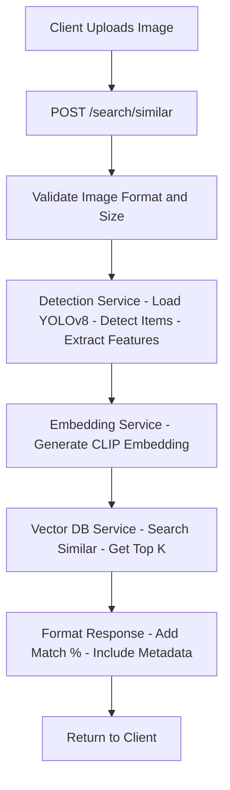

#### 2. Text Search Flow

```mermaid
graph TD
   graph TD
    A[Client Sends Text Query] --> B[POST /search/text]
    B --> C[Text Search Service - Parse Query - Extract Keywords - Build Filters]
    C --> D[Vector DB Service - Semantic Search - Filter by Category or Brand]
    D --> E[Format and Return Results]

```

#### 3. Scraping Flow

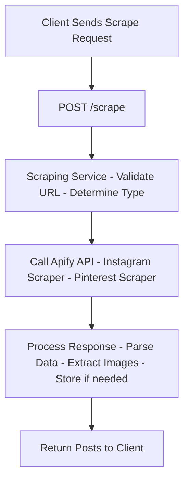

#### 4. Extraction Flow

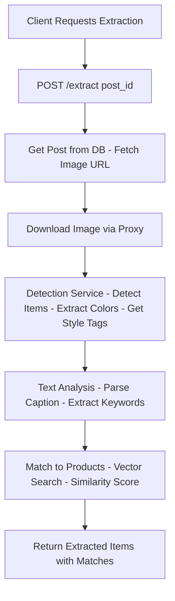

### Request Processing Pipeline

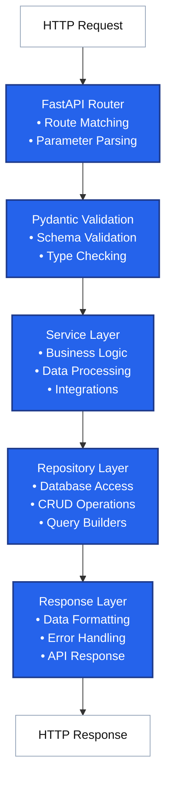

---

## Data Flow Diagrams

### Complete User Journey: Image Search

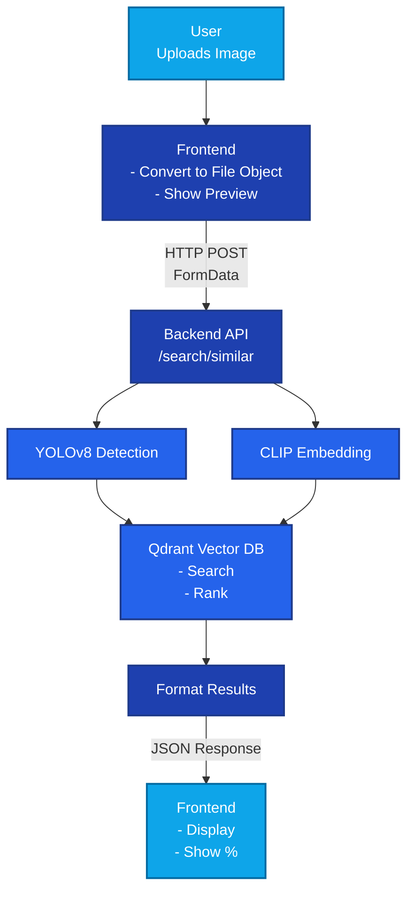

### Complete User Journey: Scraping

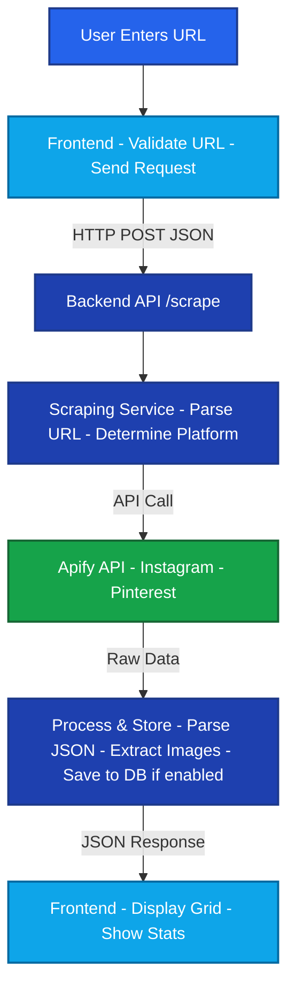

---

## API Documentation

### Base URL
```
http://localhost:8000/api/v1
```

### Authentication
Currently, the API does not require authentication. (Can be added for production)

### Endpoints

#### 1. Health Check
```
GET /health
```
**Response:**
```json
{
  "status": "healthy",
  "timestamp": "2025-01-07T10:30:00"
}
```

#### 2. Image Similarity Search
```
POST /search/similar
Content-Type: multipart/form-data
```
**Parameters:**
- `file` (File): Image file (JPEG, PNG, WebP)
- `limit` (Query, optional): Number of results (1-100, default: 10)
- `category` (Query, optional): Filter by category

**Response:**
```json
{
  "query_info": {
    "query_type": "image_search",
    "detected_items": 2,
    "processing_time_ms": 1250.5,
    "timestamp": "2025-01-07T10:30:00"
  },
  "results": [
    {
      "query_item": {
        "category": "clothing",
        "subcategory": "shirt",
        "detected_features": {
          "colors": ["blue", "white"],
          "style": ["casual"]
        }
      },
      "similar_products": [
        {
          "product_id": "prod_123",
          "similarity_score": 0.85,
          "product_info": {
            "name": "Blue Casual Shirt",
            "brand": "Brand Name",
            "price": 2999,
            "image_url": "https://...",
            "category": "clothing",
            "subcategory": "shirt"
          }
        }
      ],
      "total_matches": 50,
      "returned_count": 10
    }
  ]
}
```

#### 3. Text Search
```
POST /search/text
Content-Type: application/json
```
**Request Body:**
```json
{
  "query": "blue casual shirt",
  "limit": 20
}
```
**Response:**
```json
{
  "query": "blue casual shirt",
  "results": [
    {
      "product_id": "prod_123",
      "name": "Blue Casual Shirt",
      "brand": "Brand Name",
      "price": 2999,
      "image_url": "https://...",
      "similarity_score": 0.92
    }
  ],
  "total_results": 45
}
```

#### 4. Scrape Social Media
```
POST /scrape?save_to_db=false
Content-Type: application/json
```
**Request Body:**
```json
{
  "url": "https://www.instagram.com/username/",
  "post_limit": 50,
  "use_api": true
}
```
**Response:**
```json
{
  "success": true,
  "message": "Scraped 25 posts",
  "total_posts": 25,
  "platform": "instagram",
  "posts": [
    {
      "structured_data": {
        "displayUrl": "https://...",
        "caption": "Post caption...",
        "likesCount": 1000,
        "commentsCount": 50
      }
    }
  ]
}
```

#### 5. Batch Scrape
```
POST /scrape/batch?save_to_db=false
Content-Type: application/json
```
**Request Body:**
```json
{
  "urls": [
    "https://www.instagram.com/user1/",
    "https://www.instagram.com/user2/"
  ],
  "post_limit": 50,
  "use_api": true
}
```

#### 6. Get Saved Posts
```
GET /scraped-posts?limit=20&offset=0&platform=instagram
```
**Response:**
```json
{
  "success": true,
  "posts": [...],
  "total": 100,
  "limit": 20,
  "offset": 0
}
```

#### 7. Delete Post
```
DELETE /posts/{post_id}?delete_extracted_items=true
```

#### 8. Extract Items from Post
```
POST /extract/{post_id}?match_to_store=true&similarity_threshold=0.7
```
**Response:**
```json
{
  "success": true,
  "post_data": {...},
  "items_by_category": {
    "clothing": [...],
    "accessories": [...]
  }
}
```

#### 9. Get All Products
```
GET /products/all
```
**Response:**
```json
{
  "success": true,
  "total": 500,
  "products": [...]
}
```

#### 10. Get Products (Paginated)
```
GET /products?limit=20&offset=0
```

#### 11. Get Product by ID
```
GET /product/{product_id}
```

#### 12. Image Proxy
```
GET /products/image-proxy?url={encoded_url}
```
Returns proxied image to handle CORS issues.

---

## Database Schema

### Tables

#### 1. instagram_posts
```sql
CREATE TABLE instagram_posts (
    id VARCHAR PRIMARY KEY,
    url VARCHAR,
    short_code VARCHAR,
    display_url VARCHAR,
    caption TEXT,
    owner_username VARCHAR,
    owner_full_name VARCHAR,
    likes_count INTEGER,
    comments_count INTEGER,
    scraped_at TIMESTAMP,
    platform VARCHAR,
    post_data JSONB,
    created_at TIMESTAMP DEFAULT NOW(),
    updated_at TIMESTAMP DEFAULT NOW()
);
```

#### 2. extracted_fashion_items
```sql
CREATE TABLE extracted_fashion_items (
    id SERIAL PRIMARY KEY,
    post_id VARCHAR REFERENCES instagram_posts(id),
    category VARCHAR,
    subcategory VARCHAR,
    colors TEXT[],
    style_tags TEXT[],
    material VARCHAR,
    pattern VARCHAR,
    extraction_method VARCHAR,
    confidence_score FLOAT,
    created_at TIMESTAMP DEFAULT NOW()
);
```

### Vector Database (Qdrant)

**Collections:**
- `fashion_products`: Stores product embeddings
  - Vectors: 512 dimensions (CLIP embeddings)
  - Payload: Product metadata (name, brand, price, category, etc.)

---

## AI/ML Integration

### 1. Object Detection (YOLOv8)

**Model:** YOLOv8n-clothing-detection  
**Purpose:** Detect fashion items in images  
**Classes Detected:**
- Clothing (shirt, t-shirt, dress, pants, etc.)
- Accessories (bag, watch, glasses, etc.)
- Shoes
- Other fashion items

**Process:**
1. Load pre-trained YOLOv8 model
2. Preprocess image (resize, normalize)
3. Run inference
4. Post-process detections (NMS, filtering)
5. Extract bounding boxes and confidence scores
6. Map to fashion categories

**Output:**
```json
{
  "detected_items": [
    {
      "category": "clothing",
      "subcategory": "shirt",
      "confidence": 0.85,
      "bbox": [x, y, width, height]
    }
  ]
}
```

### 2. Embedding Generation (CLIP)

**Model:** CLIP (Contrastive Language-Image Pre-training)  
**Purpose:** Generate vector embeddings for similarity search  
**Dimensions:** 512

**Process:**
1. Load CLIP model
2. Preprocess image
3. Generate embedding vector
4. Normalize vector
5. Store in vector database

### 3. Vector Similarity Search

**Database:** Qdrant  
**Algorithm:** Cosine similarity  
**Process:**
1. Generate query embedding
2. Search in Qdrant collection
3. Calculate similarity scores
4. Filter by threshold
5. Rank results
6. Return top K products

### 4. Semantic Text Search

**Process:**
1. Parse user query
2. Extract keywords and intent
3. Build search filters (category, brand, etc.)
4. Perform vector search with text embedding
5. Combine with metadata filters
6. Rank and return results

---

## Features & Functionality

### 1. Social Media Scraping
- **Instagram Support:**
  - Profile scraping
  - Hashtag scraping
  - Post metadata extraction
- **Pinterest Support:**
  - Board scraping
  - User profile scraping
- **Features:**
  - Batch processing
  - Database storage option
  - Error handling
  - Progress tracking

### 2. Visual Search
- Image upload
- Real-time detection
- Similar product matching
- Match percentage display
- Multiple item detection

### 3. Text Search
- Natural language queries
- Semantic understanding
- Category filtering
- Brand filtering

### 4. Product Catalog
- Browse all products
- Advanced filtering:
  - Category
  - Brand
  - Color
  - Price range
  - Style tags
- Search box
- Responsive grid layout

### 5. Posts Management
- View all scraped posts
- Post detail modal
- Find similar products from post
- Delete posts
- Pagination

### 6. Shopping Cart
- Add/remove items
- Quantity management
- Total calculation
- Persistent state

### 7. UI/UX Features
- Dark/light theme
- Responsive design
- Loading states
- Error handling
- Smooth scrolling
- Accessible components

---

## Technology Stack

### Frontend
- **Framework:** Next.js 14 (App Router)
- **Language:** TypeScript
- **UI Library:** React 18
- **Styling:** Tailwind CSS
- **Icons:** Lucide React
- **State Management:** React Context, useState
- **HTTP Client:** Fetch API

### Backend
- **Framework:** FastAPI
- **Language:** Python 3.12
- **ORM:** SQLAlchemy (async)
- **Validation:** Pydantic
- **Logging:** Loguru
- **HTTP Client:** httpx

### AI/ML
- **Object Detection:** YOLOv8 (Ultralytics)
- **Embeddings:** CLIP (OpenAI)
- **Vector DB:** Qdrant
- **Image Processing:** PIL (Pillow)

### Database
- **Relational:** PostgreSQL
- **Vector:** Qdrant

### External Services
- **Scraping:** Apify API
- **Image Proxy:** Custom endpoint

### Development Tools
- **Package Manager:** pnpm (frontend), uv (backend)
- **Code Quality:** ESLint, TypeScript
- **Version Control:** Git

---

## Deployment

### Frontend Deployment
```bash
# Build
cd frontend
pnpm build

# Start production server
pnpm start
```

**Environment Variables:**
- `NEXT_PUBLIC_API_URL`: Backend API URL

### Backend Deployment
```bash
# Install dependencies
cd backend
uv sync

# Run server
uvicorn main:app --host 0.0.0.0 --port 8000
```

**Environment Variables:**
- `DATABASE_URL`: PostgreSQL connection string
- `QDRANT_URL`: Qdrant server URL
- `APIFY_TOKEN`: Apify API token
- `YOLO_MODEL_PATH`: Path to YOLOv8 model

### Docker Deployment
```bash
# Build and run with docker-compose
docker-compose up -d
```

### Production Considerations
- Add authentication/authorization
- Implement rate limiting
- Add caching layer
- Set up monitoring
- Configure CORS properly
- Use environment-specific configs
- Set up SSL/TLS
- Implement logging and error tracking

---

## Conclusion

This Fashion-AI Search platform demonstrates a complete full-stack application with AI/ML integration. The system successfully combines:

- Modern web development (Next.js, FastAPI)
- AI/ML capabilities (YOLOv8, CLIP, Vector Search)
- Social media integration (Instagram, Pinterest)
- User-friendly interface
- Scalable architecture

The project showcases skills in:
- Full-stack development
- AI/ML integration
- API design
- Database design
- UI/UX development
- Problem-solving

---

## Appendix

### File Structure Summary

**Frontend:** ~15 components, 5 pages, API client, types  
**Backend:** ~10 services, 4 API route files, 2 repositories, 3 models  
**Total Lines of Code:** ~15,000+

### Key Design Decisions

1. **Separate Frontend/Backend:** Better scalability and maintainability
2. **Vector Database:** Efficient similarity search
3. **YOLOv8:** Pre-trained model for fast detection
4. **CLIP Embeddings:** Universal image-text embeddings
5. **Apify Integration:** Reliable scraping service
6. **TypeScript:** Type safety and better DX
7. **Tailwind CSS:** Rapid UI development

---

**End of Documentation**

